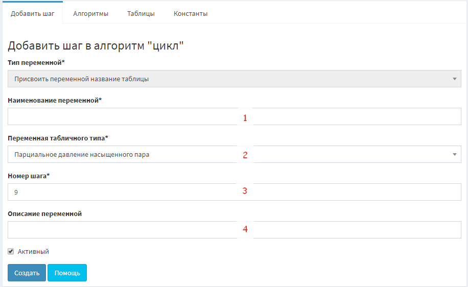

#### Операнд "Присвоить переменной название таблицы"(кодовое имя - table)
---

Поля:
1. Название **переменной**
2. Выбор таблицы(из списка **созданных** таблиц)
3. Номер шага
4. Дополнительное описание данного шага расчета

Логика работы операнда:
- операнд находит модель таблицы(это xls файл, хранится в базе данных)
- из этого файла рассматривается **только** лист с индексом 0 (*это первый лист Книги*)
- формируется **верхняя информационная строка**(ВИС): это первая строка, начиная со второго столбца
- формируется **левый информационный столбец**(ЛИС): это первый столбец, начиная со второго ряда
- формируется **матрица данных**(МД): все данные листа, кроме ВИС и ЛИС

- **переменной** присваивается вот такой словарь:
		
		{
            'values': table_data,  # МД
            'info_top': info_top,  # ВИС
            'info_left': info_left # ЛИС
        }
		

